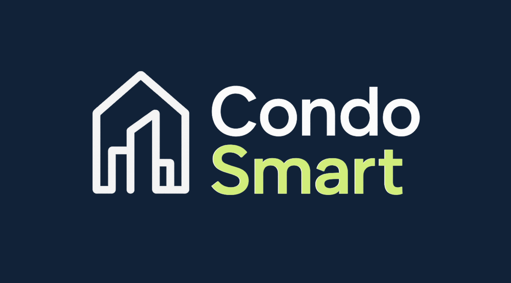

  

## Sumário

1. [O Problema](#1-o-problema-️)
2. [A Solução](#2-a-solução-)
3. [Público Alvo](#3-público-alvo-)
4. [Links Úteis](#4-links-úteis)
5. [Apresentação Video](#5-apresentação-condosmart)
6. [Equipe ](#6-equipe-)

---

## 1. O Problema 

A gestão de condomínios residenciais e comerciais enfrenta diversos desafios operacionais no dia a dia, tais como a comunicação ineficiente entre moradores, síndicos e portaria, o controle burocrático de pagamentos das taxas condominiais, a reserva manual de áreas comuns (como salões de festas e churrasqueiras) e a falta de rastreabilidade na abertura e atendimento de chamados de manutenção.

A ausência de um sistema centralizado dificulta o acompanhamento financeiro, gera atrasos e filas no cadastro e liberação de visitantes na portaria, além de comprometer a transparência na divulgação de atas de reuniões e comunicados oficiais. Isso resulta em retrabalho para a administração, custos desnecessários e insatisfação dos condôminos.

---

## 2. A Solução

O **CondoSmart** é um sistema digital desenvolvido com tecnologias modernas que visa automatizar e centralizar a gestão de condomínios por meio de uma plataforma web integrada e intuitiva.

Funcionalidades principais:
- Registro e controle de unidades residenciais, moradores, síndicos e gestores
- Agendamento e reserva de áreas de lazer em tempo real
- Controle dinâmico da taxa de condomínio e acompanhamento de pagamentos
- Registro, acompanhamento e resolução de chamados de manutenção/ocorrências
- Cadastro e controle de acesso de visitantes na portaria
- Disponibilização e consulta de atas de reuniões e avisos do condomínio
- Autenticação e gestão de acessos baseada em perfis de usuários

Com uma arquitetura desenvolvida em .NET (ASP.NET Core / Razor Pages) e frontend dinâmico em JavaScript, HTML5 e CSS3, o CondoSmart oferece confiabilidade, desempenho e facilidade de uso para gestores e moradores.

---

## 3. Público Alvo 🎯

- **Síndicos e Administradoras de Condomínios** que buscam digitalizar e centralizar a gestão operacional, financeira e a comunicação.
- **Moradores e Condôminos** que desejam praticidade para reservar áreas comuns, consultar boletos/pagamentos e registrar chamados.
- **Porteiros e Equipes de Segurança** que necessitam de um fluxo rápido e confiável para cadastro e liberação de visitantes.

---

## 4. Links Úteis 🔗

  <!-- BOTÃO MANUAL -->
  
   
  https://docs.google.com/presentation/d/1_O_KQoR4Om_i41cJD2KngU37DdImLt6un5eWx3aL1aw/edit?usp=sharing
    

  <!-- BOTÃO REPOSITÓRIO -->
  
   
  https://github.com/marcosdosea/CondoSmart
    

  ## 5. Apresentação CondoSmart
 

  
    
  

---

## 6. Equipe 👥

<table>
  <tr>
    <td align="center">
       
      <b>João Keweni S. R.</b> 
      Desenvolvedor
    </td>
    <td align="center">
       
      <b>Davi Cardoso</b> 
      Desenvolvedor
    </td>
    <td align="center">
       
      <b>Venicius Bispo</b> 
      Desenvolvedor
    </td>
    <td align="center">
       
      <b>José Adryel Almeida</b> 
      Desenvolvedor
    </td>
  </tr>
  <tr>
    <td align="center">
       
      <b>Marcos Yago</b> 
      Desenvolvedor
    </td>
    <td align="center">
       
      <b>Vivian</b> 
      Desenvolvedora
    </td>
    <td align="center">
       
      <b>Doutor Marcos Dósea</b> 
      Product Owner
    </td>
  </tr>
</table>

---

> Projeto desenvolvido com foco em eficiência na gestão condominial e na melhoria da experiência de moradores e administradores.
